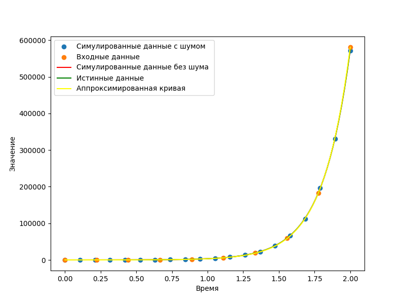
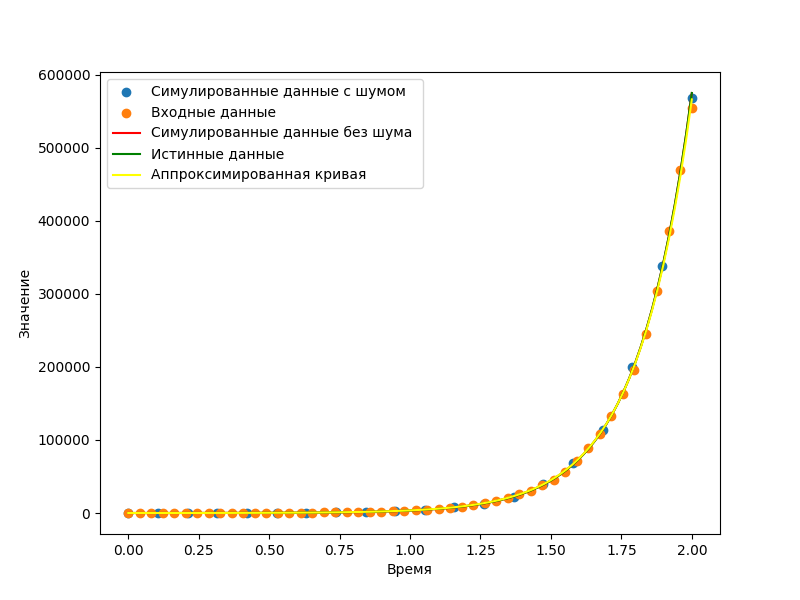

# Анализ

Рассмотрим работу алгоритма на нескольких примерах. 

Прежде чем переходить к рассмотрению данных с шумом, стоит заметить, что в силу специфики нелинейного метода наименьших квадратов на чистых данных (без добавления шума) для вычисления точных коэффициентов в большинстве случаев достаточно трёх точек, что можно увидеть на примере экспериментов 3, 6, 9

Эксперименты 1,2 и 3 позволяют заметить, что с увеличением количества точек точность предскахания данных с шумом растёт, что полностью соответствует ожиданию, ведь большее количество данных позволяет сглаживать выбросы, порождаемые шумом, увеличивая точность предсказания.

Наиболее заметен вносимый шумом эффект в эксперименте 2. Из-за небольшого числа точек роль шума ожидаемо возрастает, серьёзно изменяя предсказываемые параметры.

Также стоит отметить, что выводы, сделанные на основе наблюдений 1, 2 и 3 не имеют отношения к специфичности значений или знаков коэффициентов, в чём легко убедиться, рассмотрев рещультаты двух следующих серий экспериментов.

# Test 1
Output:

True parameters: [-1.5, 10]

Fitted Parameters with noise: [-1.40183227  9.56029283]

Fitted Parameters without noise:[-1.5 10. ]

# Test 2
Output:

True parameters: [-1.5, 10]

Fitted Parameters with noise: [-1.46345454  9.85689143]

Fitted Parameters without noise:[-1.5 10. ]

# Test 3
Output:

True parameters: [-1.5, 10]

Fitted Parameters with noise: [-1.56607599 10.35830856]

Fitted Parameters without noise:[-1.5 10. ]

# Test 4
Output:

True parameters: [2.5, -1]

Fitted Parameters with noise: [ 2.51751566 -1.04024345]

Fitted Parameters without noise:[ 2.5 -1. ]

# Test 5
Output:

True parameters: [2.5, -1]

Fitted Parameters with noise: [ 2.50747358 -1.01369427]

Fitted Parameters without noise:[ 2.5 -1. ]

# Test 6
Output:

True parameters: [2.5, -1]

Fitted Parameters with noise: [ 2.48794881 -0.9742071 ]

Fitted Parameters without noise:[ 2.5 -1. ]

# Test 7
Output:

True parameters: [11.12, 100]

Fitted Parameters with noise: [ 9.68608531 20.95394717]

Fitted Parameters without noise:[ 9.68606223 20.95389375]

# Test 8
Output:

True parameters: [11.12, 100]

Fitted Parameters with noise: [12.34889419  5.92016464]

Fitted Parameters without noise:[12.35016729  5.80428104]

# Test 9
Output:

True parameters: [11.12, 100]

Fitted Parameters with noise: [2.443871   2.49033528]

Fitted Parameters without noise:[2.40634408 2.35959369]
