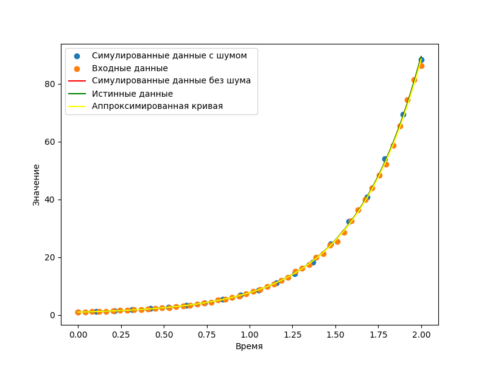

# Test 1
Output:

True parameters: [-1.5, 10]

Fitted Parameters with noise: [-1.40183227  9.56029283]

Fitted Parameters without noise:[-1.5 10. ]

# Test 2
Output:

True parameters: [-1.5, 10]

Fitted Parameters with noise: [-1.46345385  9.85688693]

Fitted Parameters without noise:[-1.5 10. ]

# Test 3
Output:

True parameters: [-1.5, 10]

Fitted Parameters with noise: [-1.56607609 10.35830923]

Fitted Parameters without noise:[-1.5 10. ]

# Test 4
Output:

True parameters: [2.5, -1]

Fitted Parameters with noise: [ 2.51751566 -1.04024345]

Fitted Parameters without noise:[ 2.5 -1. ]

# Test 5
Output:

True parameters: [2.5, -1]

Fitted Parameters with noise: [ 2.50747358 -1.01369429]

Fitted Parameters without noise:[ 2.5 -1. ]

# Test 6
Output:

True parameters: [2.5, -1]

Fitted Parameters with noise: [ 2.48794885 -0.97420723]

Fitted Parameters without noise:[ 2.5 -1. ]
