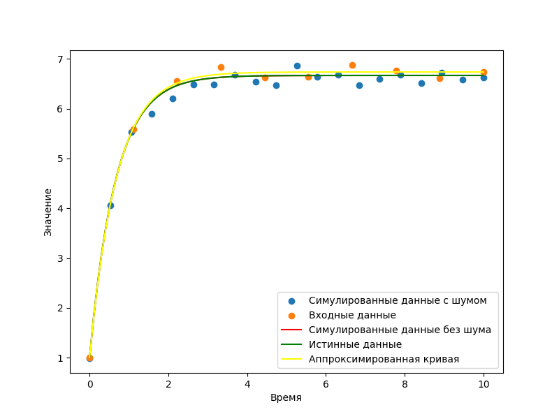

# Test 1
Output:

True parameters: [3.21, 1.11]

Fitted Parameters with noise: [3.19191037 1.20865601]

Fitted Parameters without noise:[3.21 1.11]

# Test 2
Output:

True parameters: [1.5, 10]

Fitted Parameters with noise: [1.50771631 9.25080933]

Fitted Parameters without noise:[ 1.5 10. ]
