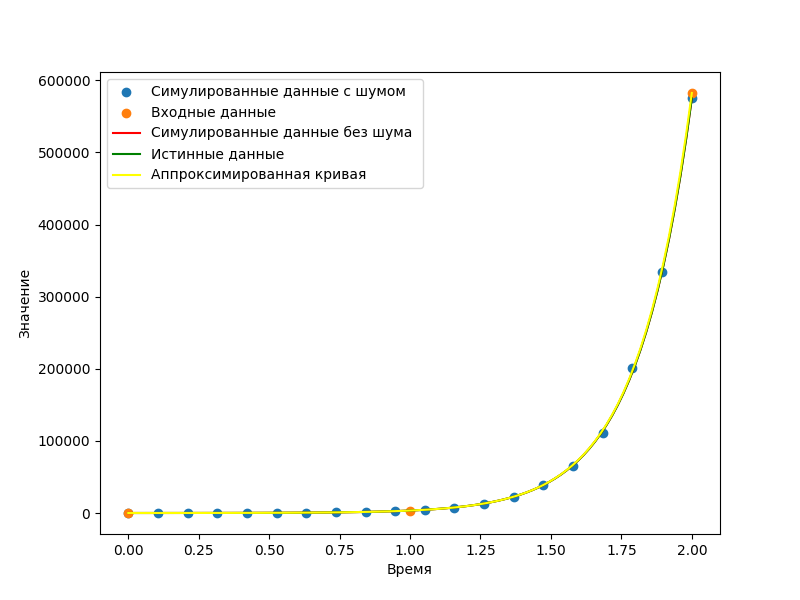

# Анализ

Рассмотрим работу алгоритма на нескольких примерах. 

Прежде чем переходить к рассмотрению данных с шумом, стоит заметить, что в силу специфики нелинейного метода наименьших квадратов на чистых данных (без добавления шума) для вычисления точных коэффициентов в большинстве случаев достаточно трёх точек, что можно увидеть на примере экспериментов 1, 4, 7

Эксперименты 1,2 и 3 позволяют заметить, что с увеличением количества точек точность предскахания данных с шумом растёт, что полностью соответствует ожиданию, ведь большее количество данных позволяет сглаживать выбросы, порождаемые шумом, увеличивая точность предсказания.

Наиболее заметен вносимый шумом эффект в эксперименте 2. Из-за небольшого числа точек роль шума ожидаемо возрастает, серьёзно изменяя предсказываемые параметры.

Также стоит отметить, что выводы, сделанные на основе наблюдений 1, 2 и 3 не имеют отношения к специфичности значений или знаков коэффициентов, в чём легко убедиться, рассмотрев рещультаты двух следующих серий экспериментов.

# Test 1
Output:

True parameters: [-1.5, 10]

Fitted Parameters with noise: [-1.40183227  9.56029283]

Fitted Parameters without noise:[-1.5 10. ]

R squared: [-9.69762852  0.03874217]

# Test 2
Output:

True parameters: [-1.5, 10]

Fitted Parameters with noise: [-1.46345385  9.85688693]

Fitted Parameters without noise:[-1.5 10. ]

R squared: [-10.23486141   0.01286733]

# Test 3
Output:

True parameters: [-1.5, 10]

Fitted Parameters with noise: [-1.56607609 10.35830923]

Fitted Parameters without noise:[-1.5 10. ]

R squared: [-11.20273126  -0.03321296]

# Test 4
Output:

True parameters: [2.5, -1]

Fitted Parameters with noise: [ 2.51751566 -1.04024345]

Fitted Parameters without noise:[ 2.5 -1. ]

R squared: [ 4.57255126 -0.00995575]

# Test 5
Output:

True parameters: [2.5, -1]

Fitted Parameters with noise: [ 2.50747358 -1.01369429]

Fitted Parameters without noise:[ 2.5 -1. ]

R squared: [ 4.52374765e+00 -3.36543197e-03]

# Test 6
Output:

True parameters: [2.5, -1]

Fitted Parameters with noise: [ 2.48794885 -0.97420723]

Fitted Parameters without noise:[ 2.5 -1. ]

R squared: [4.45477817 0.00627432]

# Test 7
Output:

True parameters: [5.12, 100]

Fitted Parameters with noise: [ 5.13573328 98.36448288]

Fitted Parameters without noise:[  5.12 100.  ]

R squared: [-9.06728919e+01  1.71005398e-02]

# Test 8
Output:

True parameters: [5.12, 100]

Fitted Parameters with noise: [ 5.1740009  91.17320456]

Fitted Parameters without noise:[  5.12 100.  ]

R squared: [-77.89058706   0.08616265]

# Test 9
Output:

True parameters: [5.12, 100]

Fitted Parameters with noise: [  5.06069761 110.13839553]

Fitted Parameters without noise:[  5.12 100.  ]

R squared: [-1.16285726e+02 -1.14862655e-01]
